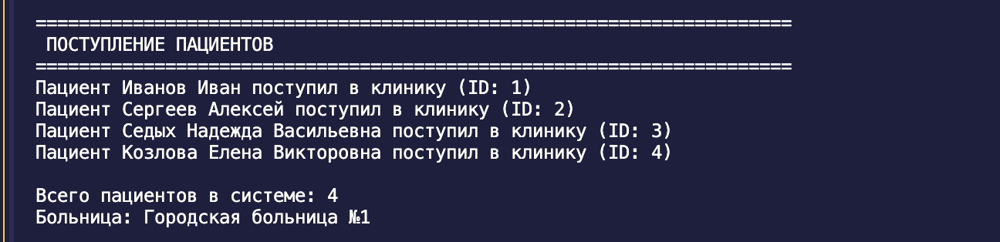
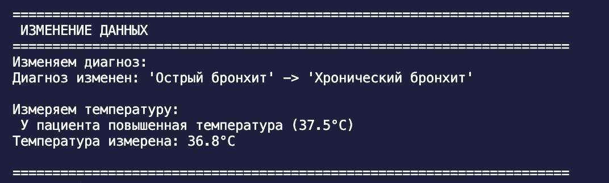
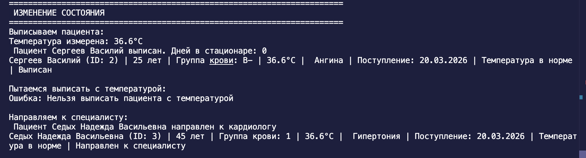
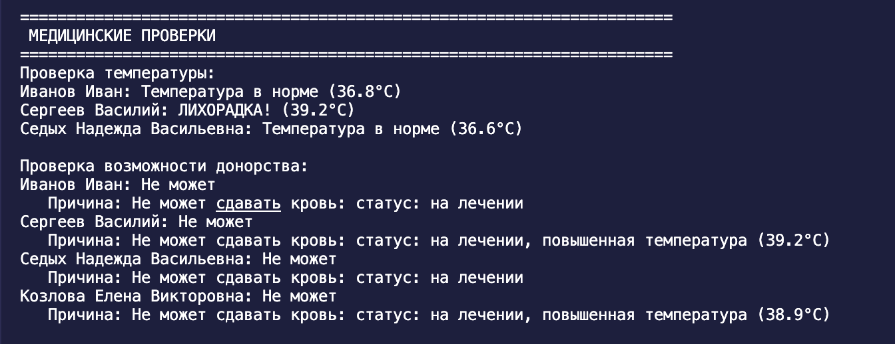
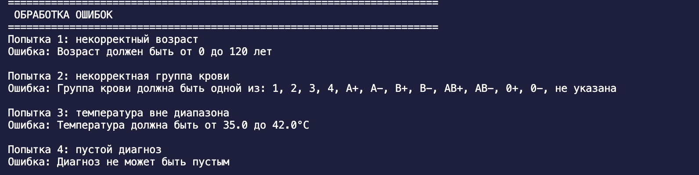
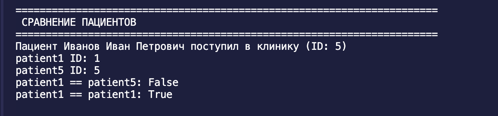

# Лабораторная работа-1 — Класс и инкапсуляция (Python 3.x)

## Цель работы

* Освоить объявление пользовательских классов.
* Разобраться с инкапсуляцией (атрибуты экземпляра, закрытые поля).
* Реализовать свойства (`@property`).
* Переопределить магические методы (`__str__`, `__repr__`, `__eq__`).
* Осознать разницу между атрибутами класса и экземпляра.

## Вариант 10. Медицина

### Класс:
* Patient
 
 
### Атрибуты класса:

total_patients — счетчик для генерации ID пациентов

hospital_name — название больницы

MIN_TEMP_FOR_FEVER — минимальная температура для определения лихорадки

MAX_NORMAL_TEMP — максимальная нормальная температура

Закрытые поля:

_full_name — ФИО пациента

_age — возраст пациента

_blood_type — группа крови

_diagnosis — диагноз

_temperature — температура тела

_status — статус пациента (на лечении, направлен, выписан)

_admission_date — дата поступления

_discharge_date — дата выписки

_patient_id — ID пациента

### Свойства @property:

Чтение: full_name — ФИО пациента

Чтение: age — возраст

Чтение: blood_type — группа крови

Чтение и запись: diagnosis — диагноз

Чтение и запись: temperature — температура тела

Чтение: status — статус пациента

Чтение: patient_id — ID пациента

Чтение: admission_date — дата поступления

Чтение: discharge_date — дата выписки

Вычисляемое: days_in_hospital — количество дней в больнице

### Магические методы:

__str__ — для print (читаемое описание)

__repr__ — для разработчиков (информация для отладки)

__eq__ — сравнение по ID пациента

__lt__ — сравнение для сортировки по дате поступления

### Бизнес-методы:

discharge() — выписать пациента с проверкой условий

refer_to_specialist(specialist) — направить к специалисту

has_fever() — проверка наличия лихорадки

is_temperature_normal() — проверка нормальной температуры

can_donate_blood() — проверка возможности сдачи крови

get_health_status() — получение статуса здоровья

## Сценарий 1: Поступление и лечение

 ## Сценарий 2: Выписка пациента

 ## Сценарий 3: Направление к специалисту

## Сценарий 4: Донорство (Бизнес-метод)

## Сценарий 5:  Ошибки валидации
 

## Сценарий 6: Сравнение (Магические методы)

__init__ - 	Создание объекта
__str__	 - Красивый вывод
__repr__ - Технический вывод
__eq__ - Сравнение на равенство
__lt__	- Сравнение для сортировки
\